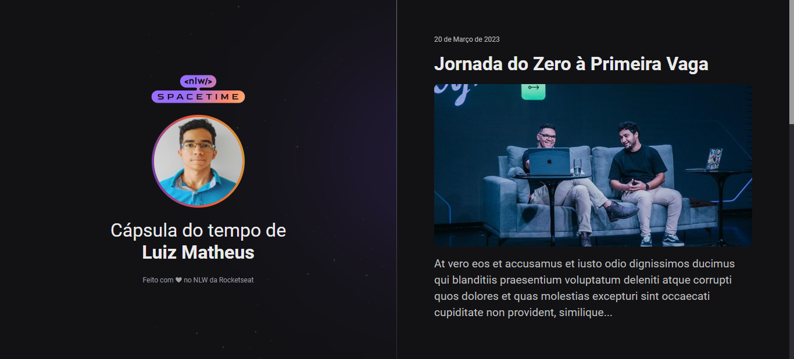

    

## 💻 Projeto
Este projeto foi desenvolvido como parte da Next Level Week, uma semana de programação intensiva oferecida pela Rocketseat.

Este website é capaz de se adaptar a vários tamanhos de tela, desde celulares até desktops. 

Isso permite que os usuários possam acessar o website de qualquer dispositivo.

## 🚀 Tecnologias
Esta Cápsula do Tempo é um website feito com HTML e CSS.

Este projeto foi voltado para habilidades de front-end e é uma forma de explorar o conceito de web design. 
